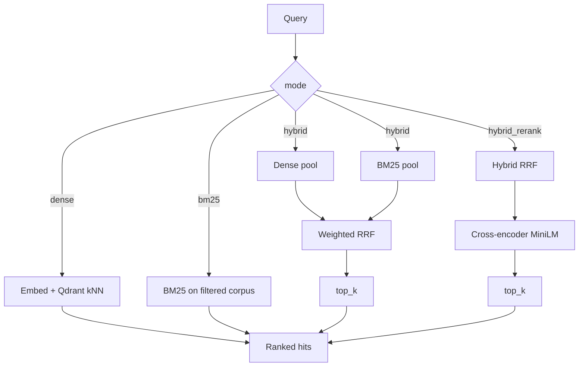

# Hybrid Search RAG

Document ingestion plus **dense**, **BM25**, **hybrid RRF**, and **cross-encoder rerank** search. The API does **not** generate LLM answers or verify citations.

## Architecture

```
Upload → parse (pypdf / UTF-8) → word chunk (helpers.chunk_text)
      → BAAI/bge-small-en-v1.5 embeddings (batched)
      → Qdrant cosine collection (384-d) + JSON-persisted BM25
Search → one of four strategies (same metadata filters on both indexes)
```



| Path | Role |
|------|------|
| `app/main.py` | FastAPI factory and lifespan (Qdrant, embedder, reranker, BM25 load) |
| `app/api/routes/` | `POST /documents`, `POST /search`, `GET /health` |
| `app/services/` | parse, chunk, embed, ingest, Qdrant, BM25, RRF fusion, rerank, search |
| `app/helpers.py` | `tokenize`, PDF extract, `chunk_text` / `chunk_text_para` |
| `docs/` | Small sample corpus for the v1 benchmark |
| `main.py` | Re-exports `app` for `uvicorn main:app` |

Chunk IDs are deterministic: `document_id` is SHA-256 of the raw bytes; `chunk_id` is `sha256(document_id:chunk_index:normalized_text)[:32]`. Qdrant point IDs are UUID5 values derived from `chunk_id`.

**Idempotency:** re-uploading the **same bytes** returns HTTP **200** with `idempotent_replay: true` and the same IDs (no duplicate points). If those bytes are uploaded under a **new filename**, stored `source` in Qdrant and BM25 is rewritten to the latest name so `filters.source` matches the client upload (still no duplicate points). Re-uploading the **same filename with different bytes** deletes prior points/BM25 docs for that source, then inserts. A first-time ingest returns HTTP **201**.

## Search strategies

`POST /search` keeps the JSON field **`mode`** (`search_mode` is accepted as an alias). Values: `dense` | `bm25` | `hybrid` | `hybrid_rerank`.

| Mode | Behavior |
|------|----------|
| `dense` | Qdrant cosine kNN (`BAAI/bge-small-en-v1.5`, 384-d) |
| `bm25` | `rank_bm25` over the same chunks and filters |
| `hybrid` | Independent dense and BM25 pools (default 20 each), then weighted RRF, then `top_k` |
| `hybrid_rerank` | Hybrid fuse, then cross-encoder over `rerank_candidate_count` (default 20; callers often use `top_k=5` for this mode) |

API default `top_k` remains **10** so configs can be compared fairly. Hybrid and rerank are **not** assumed to beat dense or BM25.

### Reciprocal Rank Fusion

Raw BM25 and cosine scores live on incompatible scales, so fusion uses **ranks only**:

```
rrf(d) = w'_dense * 1/(k + rank_dense(d)) + w'_bm25 * 1/(k + rank_bm25(d))
```

Ranks are 1-based. A chunk in only one list contributes `0` for the missing retriever. Default `k` (`rrf_k`) is **60**. Weights default to `1.0` / `1.0` and are normalized:

```
w'_dense = dense_weight / (dense_weight + bm25_weight)
w'_bm25  = bm25_weight / (dense_weight + bm25_weight)
```

Both weights `0` is rejected (422). Ties: higher RRF first, then `chunk_id` lexicographic ascending. Hits keep original dense/BM25 ranks and scores plus `contributed_by`.

### Cross-encoder rerank

Model: `cross-encoder/ms-marco-MiniLM-L6-v2`. Loaded **once** in FastAPI lifespan (same pattern as the embedder). Device defaults to **CPU** (`RERANKER_DEVICE`). The first real-model run downloads MiniLM from Hugging Face.

Raw cross-encoder scores are **ranking utilities, not probabilities**. Final `score` is the reranker score; `rrf_score` is retained.

## Setup

Python 3.13.5, package manager **uv**.

```bash
cp .env.example .env
uv sync
docker compose up -d qdrant
uv run uvicorn app.main:app --reload
```

Settings load from the **backend repo root** `.env` (the directory that contains `app/` and `.env.example`), not from the process working directory. Start from that root as shown above. Running `uv run uvicorn main:app --reload` from `app/` is still valid because the env path is absolute.

The API listens on `http://127.0.0.1:8000`. Docs: `http://127.0.0.1:8000/docs`.

To run the API in Compose as well: `docker compose up -d` (Qdrant + `api` on port 8000). The API service uses `QDRANT_URL=http://qdrant:6333`.

## Environment variables

See `.env.example` for required local-dev values. Copy it to `.env` at the backend root; empty values are ignored, and missing `QDRANT_URL`, `QDRANT_COLLECTION`, `EMBEDDING_MODEL`, or `RERANKER_MODEL` fail at startup. Relative paths such as `BM25_INDEX_PATH` resolve against the repo root.

| Variable | Default | Meaning |
|----------|---------|---------|
| `QDRANT_URL` | `http://localhost:6333` | Use `:memory:` only in tests |
| `QDRANT_COLLECTION` | `rag_chunks` | Cosine, 384 dimensions |
| `EMBEDDING_MODEL` | `BAAI/bge-small-en-v1.5` | Sentence-Transformers model |
| `EMBEDDING_BATCH_SIZE` | `32` | Encode batch size |
| `CHUNK_SIZE` / `CHUNK_OVERLAP` | `400` / `50` | Word windows |
| `MAX_UPLOAD_BYTES` | `10485760` (10 MB) | Upload cap |
| `BM25_INDEX_PATH` | `data/bm25_index.json` | Persisted BM25 corpus; rebuilt from Qdrant on startup if empty |
| `DENSE_CANDIDATE_COUNT` | `20` | Dense pool size for hybrid |
| `BM25_CANDIDATE_COUNT` | `20` | BM25 pool size for hybrid |
| `RERANK_CANDIDATE_COUNT` | `20` | Fused pool size sent to the cross-encoder |
| `RRF_K` | `60` | RRF smoothing constant |
| `DENSE_WEIGHT` / `BM25_WEIGHT` | `1.0` / `1.0` | Unnormalized fusion weights |
| `RERANKER_MODEL` | `cross-encoder/ms-marco-MiniLM-L6-v2` | Cross-encoder |
| `RERANKER_DEVICE` | `cpu` | Torch device for the reranker |
| `RERANKER_BATCH_SIZE` | `16` | Cross-encoder `predict` batch size |

## API examples

Health:

```bash
curl -s http://127.0.0.1:8000/health
```

Ingest (PDF, Markdown, or TXT). Optional form fields: `chunk_size`, `overlap`.

```bash
curl -s -X POST http://127.0.0.1:8000/documents \
  -F "file=@docs/aurora_protocol.md;type=text/markdown"
```

Dense:

```bash
curl -s -X POST http://127.0.0.1:8000/search \
  -H "Content-Type: application/json" \
  -d '{"query":"What is the Zephyr handshake?","mode":"dense","top_k":10}'
```

BM25 with a source filter:

```bash
curl -s -X POST http://127.0.0.1:8000/search \
  -H "Content-Type: application/json" \
  -d '{"query":"compound XJ-19","mode":"bm25","top_k":5,"filters":{"source":"nimbus_lab.txt"}}'
```

Hybrid RRF:

```bash
curl -s -X POST http://127.0.0.1:8000/search \
  -H "Content-Type: application/json" \
  -d '{"query":"Zephyr handshake","mode":"hybrid","top_k":10,"dense_candidate_count":20,"bm25_candidate_count":20,"rrf_k":60,"dense_weight":1.0,"bm25_weight":1.0,"debug":true}'
```

Hybrid then rerank (`top_k=5` is typical for this mode; default remains 10):

```bash
curl -s -X POST http://127.0.0.1:8000/search \
  -H "Content-Type: application/json" \
  -d '{"query":"teal fluorescent compound","mode":"hybrid_rerank","top_k":5,"rerank_candidate_count":20}'
```

Invalid `mode` yields 422. Empty query yields 422. `top_k` below 1 yields 422; values above 100 are clamped to 100. Both fusion weights `0` yields 422. For `hybrid_rerank`, `rerank_candidate_count < top_k` yields 422.

Response shape (nulls when a stage did not run):

```json
{
  "query": "Zephyr handshake",
  "mode": "hybrid",
  "top_k": 10,
  "latency_ms": 12.34,
  "timing": {
    "dense_ms": 4.1,
    "bm25_ms": 1.2,
    "fusion_ms": 0.2,
    "rerank_ms": null,
    "total_ms": 12.34
  },
  "results": [
    {
      "rank": 1,
      "chunk_id": "...",
      "document_id": "...",
      "score": 0.0164,
      "text": "...",
      "metadata": {"source": "aurora_protocol.md", "content_type": "markdown", "page_num": 1, "chunk_index": 0, "char_start": 0, "char_end": 100},
      "dense_rank": 1,
      "dense_score": 0.72,
      "bm25_rank": 2,
      "bm25_score": 3.1,
      "rrf_score": 0.0164,
      "rerank_score": null,
      "contributed_by": ["dense", "bm25"]
    }
  ]
}
```

`score` is always the **final** ranking score. `latency_ms` is end-to-end wall clock (same as `timing.total_ms`). Unsupported types return **415**; empty/unreadable files and invalid chunk params return **400**; oversized uploads return **413**.

## Tests

Tests use in-memory Qdrant, a hash `FakeEmbedder`, and `FakeReranker` (no Docker, no model download):

```bash
uv run pytest
uv run pytest -m unit
uv run pytest -m integration
```

## Benchmark (v1)

Corpus: `docs/` (short MD/TXT files with distinctive facts). Gold labels are **source filenames**. The original four queries are a held-out **test** split; additional queries are **validation** only (weight/candidate grid). Numbers in `benchmark/v1/summary.md` are **measured**, not assumed — hybrid may not win.

```bash
uv run python -m benchmark.v1.run --fake-embeddings --fake-rerank
```

CI-speed flags use hash embeddings and a term-overlap reranker; ranking quality is not meaningful. First real-model run downloads BGE and MiniLM:

```bash
uv run python -m benchmark.v1.run
```

The runner ingests the small files listed in `benchmark/v1/queries.json` (`corpus`), not large research PDFs that may also live in `docs/`.

## Limitations

- Tiny sample corpus; metrics are diagnostic, not a production claim.
- Fake embeddings/rerank in CI do not measure semantic or cross-encoder quality.
- CPU rerank adds latency; GPU is optional via `RERANKER_DEVICE`.
- Cross-encoder scores are uncalibrated.
- BM25 and dense scores are not comparable, which is why fusion is rank-based (RRF).
